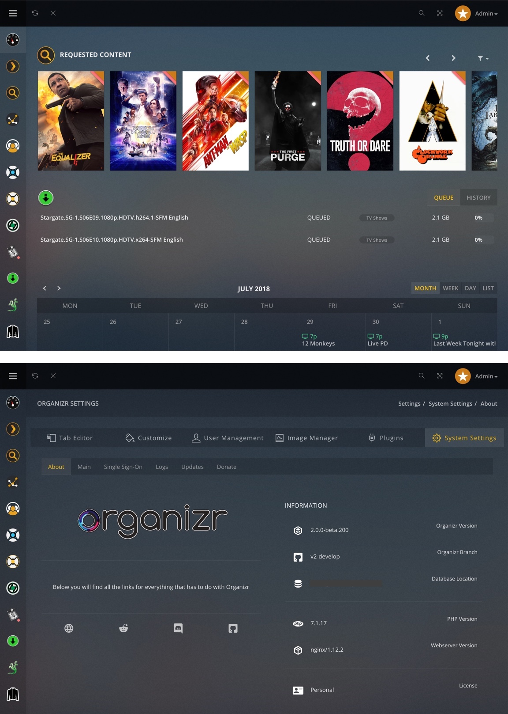

# <font style="color: #CC7B19; font-family: 'Open Sans'; font-weight: 700">Plex Theme</font> <i style="font-weight: 300">for [Organizr](https://organizr.app) v2</i>
A theme for Organizr v2 that emulates the style of Plex



## Usage

- [Download](https://github.com/Burry/organizr-v2-plex-theme/archive/master.zip) the stylesheets from [`/css`](https://github.com/Burry/organizr-v2-plex-theme/tree/master/css) to Organizr's `/css/themes` directory.
- Open Organizr Settings > Customize > Appearance > Colors & Themes, and select "Plex" or "Plex Blur" from the theme dropdown input.
- Open Organizr's `/js/custom.min.js`, search for the string `h=40`, and change it to `h=60` so that `iframe`s compensate for Plex Theme's increased nav bar padding.
- To ensure that notifications display as intended, keep the default notification type in Organizr Settings > Customize > Appearance > Notifications as "Izi."
- *Optional*: Copy the contents of the [`/images`](https://github.com/Burry/organizr-v2-plex-theme/tree/master/images) folder from Plex Theme's repository to Organizr's `/plugins/images/` directory. Plex Theme links to some assets hosted on its remote repository, but other images called in Organizr's page markup must be placed in the local installation.

### Blur Effect

[<b style="color: #CC7B19; font-family: 'Open Sans'">Plex Theme</b>](https://raw.githubusercontent.com/Burry/organizr-v2-plex-theme/master/css/Plex.css) should look good across all major browsers, but it forgoes experimental an background blur effect in favor of darker backgrounds. If your Organizr users are using Safari or another browser that currently supports [`backdrop-filter`](https://developer.mozilla.org/en-US/docs/Web/CSS/backdrop-filter), try out [<b style="color: #CC7B19; font-family: 'Open Sans'">Plex Blur Theme</b>](https://raw.githubusercontent.com/Burry/organizr-v2-plex-theme/master/css/Plex%20Blur.css). Chrome has limited support for `backdrop-filter` effects, but only if Experimental Web Platform Features are enabled in [chrome://flags](chrome://flags).

### Remove Login Chrome

Add the following lines to Organizr's `/js/functions.js` inside the function `swapDisplay` case `login` under line 277 to hide all UI chrome on the login/register page.

```
$('.sidebar').addClass('hidden');
$('.navbar').addClass('hidden');
$('#pagewrapper').addClass('hidden');
```
### Custom Colors

Changing the placeholder color values in Organizr's Colors & Themes will override Plex Theme's color styles. Deleting custom color values will reverse this. Overrides can also be made in Organizr's Custom CSS settings pane.

## Development

- Install [Yarn](https://yarnpkg.com/en/docs/install)
- [Download](https://github.com/Burry/organizr-v2-plex-theme/archive/master.zip) or clone the repository and enter it in a terminal
- Run `yarn` to install development dependencies
- Set the `homepage` value in `package.json` to your Organizr instance's URL
- Run `yarn serve` to...
    - Compile the [Sass](https://sass-lang.com/documentation/file.SASS_REFERENCE.html) stylesheets to minified CSS files and recompile when changes are detected
    - Launch a new [Browsersync](https://browsersync.io) window with the Plex Theme css injected into your Organizr instance

As you make changes in `/scss`, the stylesheet will be continually recompiled and automatically injected into the Browsersync window, so you can see your changes instantly. The following build scripts are provided for developing and testing the different theme variants.

```
yarn serve-plex
yarn serve-plex-blur
```

You can also just run `yarn build` to compile the stylesheets and watch for changes without serving a test window.
