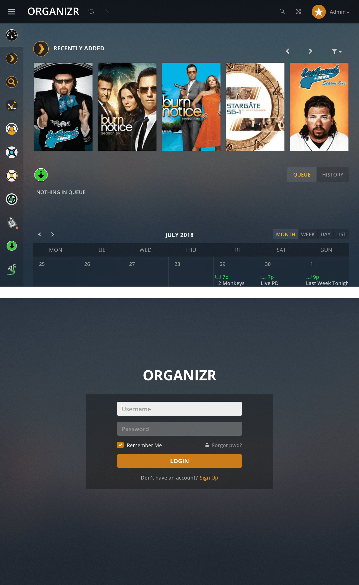

<h1 align="center">
    
</h1>

<p align="center">
    A theme for Organizr v2 that emulates the style of Plex
    <br />
    <br />
    <a href="https://travis-ci.org/Burry/organizr-v2-plex-theme" target="_blank" title="Build Status">
        
    </a>
    <a href="https://beerpay.io/Burry/organizr-v2-plex-theme" target="_blank" title="Beerpay">
        
    </a>
</p>




## Usage

1. [<b style="color: #CC7B19; font-family: 'Open Sans'">Download Plex Theme</b>](https://raw.githubusercontent.com/Burry/organizr-v2-plex-theme/master/css/Plex.css) to Organizr's `/css/themes` directory.
2. Open Organizr Settings > Customize > Appearance > Colors & Themes, select "Plex" from the theme dropdown, and keep the style set to "Dark."
3. For ideal presentation, make the necessary changes to Organizr's JavaScript as described below. Note that these changes will be overwritten whenever Organizr pulls a new update, pending more advanced theme support.


### Manual JavaScript Fixes

#### Top Bar Offset
Open Organizr's `/js/custom.min.js`, search for the string `h=40`, and change it to `h=60` so that `iframe`s compensate for Plex Theme's increased top bar padding.

#### Hide Login Page UI Chrome

Add the following lines to Organizr's `/js/functions.js` inside the function `swapDisplay` case `login` under line 277 to hide all UI chrome on the login and registration page.

```
            $('.sidebar').addClass('hidden');
            $('.navbar').addClass('hidden');
            $('#pagewrapper').addClass('hidden');
```


### Group Icons

Some group icons are provided for your use in [`/images/groups`](https://github.com/Burry/organizr-v2-plex-theme/tree/master/images/groups), to be installed in Organizr's `/plugins/images/groups`.


### Don't Change These

#### Notifications

To ensure that notifications display as intended, keep the default notification style setting "Izi" under Organizr Settings > Customize > Appearance > Notifications.

#### Custom Colors

Changing the placeholder color values in Organizr Settings > Customize > Appearance > Colors & Themes will override Plex Theme's color styles. Deleting custom color values will reverse this.


## Development

- Install [Yarn](https://yarnpkg.com/en/docs/install)
- [Download](https://github.com/Burry/organizr-v2-plex-theme/archive/master.zip) or clone the repository and enter it in a terminal
- Run `yarn` to install development dependencies

#### `yarn build`

Compiles the [Sass](https://sass-lang.com/documentation/file.SASS_REFERENCE.html) source stylesheets in `/sass` into a minified CSS file.

#### `yarn watch`

Runs `yarn build` continuously as changes are detected until exited.

#### `yarn serve`

You must first set the `homepage` value in `package.json` to your Organizr instance's URL. Then `yarn serve` runs `yarn watch` and launches a new [Browsersync](https://browsersync.io) window with the Plex Theme css injected into your Organizr instance every time it is recompiled, so you can see your changes instantly.

#### `yarn imagemin`

Losslessly optimizes all `.svg`, `.png`, `.jpg`, and `.gif` images in the repository with [imagemin](https://github.com/imagemin/imagemin). This will take some time.
